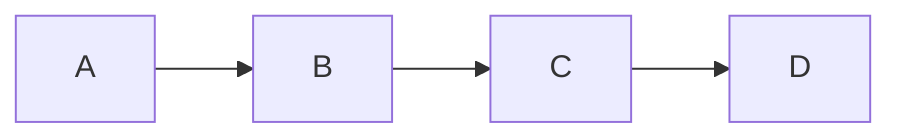

# 1.[两数之和](https://leetcode-cn.com/problems/two-sum/)

给定一个整数数组 `nums` 和一个目标值 `target`，请你在该数组中找出和为目标值的那 **两个** 整数，并返回他们的数组下标。(就是说，在数组中找出两个元素，他们的和为target)

你可以假设每种输入只会对应一个答案。但是，你不能重复利用这个数组中同样的元素。

**示例:**

```
给定 nums = [2, 7, 11, 15], target = 9
因为 nums[0] + nums[1] = 2 + 7 = 9
所以返回 [0, 1]
```

最垃圾的算法，复杂度为O(n^2^)

```python
def twoSum(nums,target):
	for index1,num1 in enumerate(nums):
		for index2,num2 in enumerate(nums):
			if (index1 != index2) and (num1 + num2 == target):
				return [index1,index2]

a = [2,5,7,9]
print(func(a,9))  # (0, 2)
```

正确的实现如下

```python
def twoSum(nums, target):
    hashmap = {}
    for index, num in enumerate(nums):
    	# 另一个数字
        another_num = target - num
        # 如果另一个数字在字典中
        if another_num in hashmap:
            return [hashmap[another_num], index]
        # 将数字本身加入到字典中
        hashmap[num] = index
    return None
```

==经验:下回遇到相加减乘除,都可以考虑移项,使用一个列表或集合将他装起来.==


------

# [7. 整数反转](https://leetcode-cn.com/problems/reverse-integer/)

给出一个 32 位的有符号整数，你需要将这个整数中每位上的数字进行反转。

**示例 1:**

```
输入: 123
输出: 321
```

 **示例 2:**

```
输入: -123
输出: -321
```

**示例 3:**

```
输入: 120
输出: 21
```

**注意:**

假设我们的环境只能存储得下 32 位的有符号整数，则其数值范围为 [−2^31^,  2^31^ − 1]。请根据这个假设，如果反转后整数溢出那么就返回 0。

下面是我写的

```python
class Solution:
    def reverse(self, x: int) -> int:
        if x >0:
            temp = int(str(x)[::-1])
        elif x <0:
            temp = - int(str(x)[1:][::-1])
        else:
            return 0
        if -2**31 <temp < 2**31-1:
            return temp
        else: return 0
```

可以更加美观:

```python
class Solution(object):
    def reverse(self, x):
    	if x < 0:
    		s = '-'
    		x = -x
    	else:
    		s = ''

    	result = s + str(x)[::-1]
    	if int(result) > pow(2, 31) - 1 or int(result) < pow(-2, 31):
    		return 0
    	return int(result)
```


------

# [9. 回文数](https://leetcode-cn.com/problems/palindrome-number/)

判断一个整数是否是回文数。回文数是指正序（从左向右）和倒序（从右向左）读都是一样的整数。

**示例 1:**

```
输入: 121
输出: true
```

**示例 2:**

```
输入: -121
输出: false
解释: 从左向右读, 为 -121 。 从右向左读, 为 121- 。因此它不是一个回文数。
```

**示例 3:**

```
输入: 10
输出: false
解释: 从右向左读, 为 01 。因此它不是一个回文数。
```

**进阶:**

你能不将整数转为字符串来解决这个问题吗？

我的代码:

```python
class Solution:
    def isPalindrome(self, x: int) -> bool:
    	x = str(x)
    	x_half_len = len(x) // 2

    	if len(x) % 2 == 0:
    		part1,part2 = x[:x_half_len],x[x_half_len:]
    	else:
    		part1,part2 = x[:x_half_len],x[x_half_len+1:]
    	
    	if part1 == part2[::-1]:
    		return True
    	else:
    		return False
```

使用算法:

```python
class Solution:
	def isPalindrome(self, x):
		temp_x = x 
		k = 0
		while temp_x != 0:
			# 重点,每次都是弹出最后一位数
			# 所以k就是倒序的x
			k = k * 10 + temp_x % 10
			print(k)
			temp_x = temp_x // 10
		if k == x:
			return True
		else:
			return False
```


------

# [13. 罗马数字转整数](https://leetcode-cn.com/problems/roman-to-integer/)

罗马数字包含以下七种字符: `I`， `V`， `X`， `L`，`C`，`D` 和 `M`。

```
字符          数值
I             1
V             5
X             10
L             50
C             100
D             500
M             1000
```

例如， 罗马数字 2 写做 `II` ，即为两个并列的 1。12 写做 `XII` ，即为 `X` + `II` 。 27 写做  `XXVII`, 即为 `XX` + `V` + `II` 。

通常情况下，**罗马数字中小的数字在大的数字的右边**。但也存在特例，例如 4 不写做 `IIII`，而是 `IV`。数字 1 在数字 5 的左边，所表示的数等于大数 5 减小数 1 得到的数值 4 。同样地，数字 9 表示为 `IX`。这个特殊的规则只适用于以下六种情况：

- `I` 可以放在 `V` (5) 和 `X` (10) 的左边，来表示 4 和 9。
- `X` 可以放在 `L` (50) 和 `C` (100) 的左边，来表示 40 和 90。 
- `C` 可以放在 `D` (500) 和 `M` (1000) 的左边，来表示 400 和 900。

给定一个罗马数字，将其转换成整数。输入确保在 1 到 3999 的范围内。

**示例 1:**

```
输入: "III"
输出: 3
```

**示例 2:**

```
输入: "IV"
输出: 4
```

**示例 3:**

```
输入: "IX"
输出: 9
```

**示例 4:**

```
输入: "LVIII"
输出: 58
解释: L = 50, V= 5, III = 3.
```

**示例 5:**

```
输入: "MCMXCIV"
输出: 1994
解释: M = 1000, CM = 900, XC = 90, IV = 4.
```

代码如下:

```python
class Solution:
    def romanToInt(self, s):
        hashmap = {'I':1,'V':5,'X':10,'L':50,'C':100,'D':500,'M':1000} 
        result = 0        

        for i in range(len(s)):
            # 特殊情况
            if i < len(s)-1 and hashmap[s[i]] < hashmap[s[i+1]]:   
            	# XLII:此时就把X当成-10
                result -= hashmap[s[i]]
            else:
                result += hashmap[s[i]]
        return result
```

我一开始想的是跳过:当遇到XL,当扫描到X时直接输出90,然后跳过L.
==经验:当想要跳过的时候,可以考虑X本身可以变成什么==


------

# [14. 最长公共前缀](https://leetcode-cn.com/problems/longest-common-prefix/)

编写一个函数来查找字符串数组中的最长公共前缀。

如果不存在公共前缀，返回空字符串 `""`。

**示例 1:**

```
输入: ["flower","flow","flight"]
输出: "fl"
```

**示例 2:**

```
输入: ["dog","racecar","car"]
输出: ""
解释: 输入不存在公共前缀。
```

**说明:**

所有输入只包含小写字母 `a-z` 。  

代码如下:

```python
class Solution:
    def longestCommonPrefix(self, strs: List[str]) -> str:
        maxStr, minStr = max(strs, default=""), min(strs, default="")
        for i in range(len(minStr)):
            if maxStr[i] != minStr[i]:
                return minStr[:i]
        # 如果for里的if都成功,说明最短单词就是共同子串
        return minStr
```

==经验:==

1. ==如果比较数组for循环的两个each,可以考虑是不是只需比较最长和最短的两个.
   如果是在不行,可以取出数组的第一个值,然后使用for循环.==
2. ==那么如何比较最长和最短的两个,先将他们在for外面取出来,然后在for里使用index,这样就可以使用两个索引来取出这两个值了==
3. ==所以说不要总是想着使用for each in alist,而是使用for index in range(len(alist)-1)==

如果使用二分法:

```python
class Solution:
    def longestCommonPrefix(self, strs):
        if not strs == []:
            minlen = min([len(x) for x in strs])
            if minlen == 0:
            	return ''
            # 使用二分法
            low = 1
            high = minlen
            while low <= high:
                mid = (low + high) // 2
                if self.start_with(strs,mid):
                    low = mid + 1
                else:
                    high = mid - 1
            # 注意这里要使用min(low,high)
            return strs[0][:min(low,high)]
        else:
            return ''

    def start_with(self,strs,str_len):
        word = strs[0][:str_len]
        for each in strs:
            if not each.startswith(word):
                return False
        return True
```


------

# [20. 有效的括号](https://leetcode-cn.com/problems/valid-parentheses/)

给定一个只包括 `'('`，`')'`，`'{'`，`'}'`，`'['`，`']'` 的字符串，判断字符串是否有效。

有效字符串需满足：

1. 左括号必须用相同类型的右括号闭合。
2. 左括号必须以正确的顺序闭合。

注意空字符串可被认为是有效字符串。

**示例 1:**

```
输入: "()"
输出: true
```

**示例 2:**

```
输入: "()[]{}"
输出: true
```

**示例 3:**

```
输入: "(]"
输出: false
```

**示例 4:**

```
输入: "([)]"
输出: false
```

**示例 5:**

```
输入: "{[]}"
输出: true
```

使用栈,代码如下:

```python
class Solution:
    def isValid(self,s):
        hashmap = {')':'(',']':'[','}':'{'}
        stack = []
        # 特殊情况
        if s == '':
        	return True
        elif not s[0] in ['(','[','{']:
        	return False

        for each in s:
            # 遇到左括号就将他们压入栈
        	if each in ['(','[','{']:
        		stack.append(each)
        	# 当遇到右括号
        	else:
        		if stack and stack[-1] == hashmap[each]:
        			stack.pop()
        		else:
        			return False
        # 最后当stack为空,说明全部配对成功
        if not stack:
        	return True
        else:
        	return False
```

还有一种思路:

```python
class Solution:
    def isValid(self, s):
        while '{}' in s or '()' in s or '[]' in s:
            s = s.replace('{}', '')
            s = s.replace('[]', '')
            s = s.replace('()', '')
        return s == ''
```


------

# [21. 合并两个有序链表](https://leetcode-cn.com/problems/merge-two-sorted-lists/)

将两个有序链表合并为一个新的有序链表并返回。新链表是通过拼接给定的两个链表的所有节点组成的。 

**示例：**

```
输入：1->2->4, 1->3->4
输出：1->1->2->3->4->4
```

链表定义如下:

```python
# Definition for singly-linked list.
class ListNode:
    def __init__(self, x):
        self.val = x
        self.next = None
```

我的代码如下:

```python
class Solution:
    def mergeTwoLists(self, l1: ListNode, l2: ListNode) -> ListNode:
        newnode = ListNode(None)
        # 注意这里,否则最后只会返回最后一个节点
        result = newnode

        while l1 or l2:
            # 当l1和l2都存在
            if l1 and l2:
            	# 当l2的值比较小
                if l1.val >= l2.val:
                	# 注意需要使用ListNode类来新建一个节点
                    newnode.next = ListNode(l2.val)
                    newnode = newnode.next
                    l2 = l2.next
                # 当l1的值比较小
                else:
                    newnode.next = ListNode(l1.val)
                    newnode = newnode.next
                    l1 = l1.next
            # 当l1存在而l2不存在
            elif l1 and (not l2):
                newnode.next = ListNode(l1.val)
                newnode = newnode.next
                l1 = l1.next
            # 当l2存在而l1不存在
            elif l2 and (not l1):
                newnode.next = ListNode(l2.val)
                newnode = newnode.next
                l2 = l2.next
        # 因为刚刚创建newnode的时候,传入了None作为头节点,需要使用next去除
        return result.next
```

==经验:==

1. ==注意13-15行,使用next连接的逻辑:赋值的右边必须新建一个节点==
2. ==必须使用result = newnode来建立一个副本,不然最后return newnode只会返回最后一个节点==
3. ==我们可以在新建ListNode的时候传入一个None作为头节点,最后使用next去除这个头节点==


上面的代码很垃圾,问题出在当其中一个链表不存在的时候,==不需要一个节点一个节点的移动,直接把剩下的链表连接上去就行==

```python
class Solution:
    def mergeTwoLists(self, l1: ListNode, l2: ListNode) -> ListNode:
        newnode = ListNode(None)
        result = newnode
        # 当两者都存在
        while l1 and l2:
            if l1.val >= l2.val:
                    newnode.next = ListNode(l2.val)
                    newnode = newnode.next
                    l2 = l2.next
            else:
                newnode.next = ListNode(l1.val)
                newnode = newnode.next
                l1 = l1.next
        # 当其中一个链表不存在,直接将另一个链表连接上去
        if l1 and (not l2):
            newnode.next = l1
        elif l2 and (not l1):
            newnode.next = l2
            
        return result.next
```

我们根据上面两个代码,总结如下:

```python
class Solution(object):
    def mergeTwoLists(self, l1, l2):
        # 使用链表最经常的操作,连续两次赋值
        dummy = pre = ListNode(0)
        while l1 and l2:
            if l1.val < l2.val:
                pre.next = l1
                l1 = l1.next
            else:
                pre.next = l2
                l2 = l2.next
            pre = pre.next
        # 使用惰性赋值
        pre.next = l1 or l2
        return dummy.next
```

==注意上面代码的第4行和第14行,是链表最为经常的操作.==


------

# [26. 删除排序数组中的重复项](https://leetcode-cn.com/problems/remove-duplicates-from-sorted-array/)

给定一个排序数组，你需要在**原地**删除重复出现的元素，使得每个元素只出现一次，返回移除后数组的新长度。

不要使用额外的数组空间，你必须在**原地修改输入数组**并在使用 O(1) 额外空间的条件下完成。

**示例 1:**

```
给定数组 nums = [1,1,2], 
函数应该返回新的长度 2, 并且原数组 nums 的前两个元素被修改为 1, 2。 
你不需要考虑数组中超出新长度后面的元素。
```

**示例 2:**

```
给定 nums = [0,0,1,1,1,2,2,3,3,4],
函数应该返回新的长度 5, 并且原数组 nums 的前五个元素被修改为 0, 1, 2, 3, 4。
你不需要考虑数组中超出新长度后面的元素。
```

**说明:**

为什么返回数值是整数，但输出的答案是数组呢?

请注意，输入数组是以**“引用”**方式传递的，这意味着在函数里修改输入数组对于调用者是可见的。

你可以想象内部操作如下:

```
// nums 是以“引用”方式传递的。也就是说，不对实参做任何拷贝
int len = removeDuplicates(nums);

// 在函数里修改输入数组对于调用者是可见的。
// 根据你的函数返回的长度, 它会打印出数组中该长度范围内的所有元素。
for (int i = 0; i < len; i++) {
    print(nums[i]);
}
```

我的代码:

```python
class Solution:
    def removeDuplicates(self, nums):
        if nums == []:return 0

        cur = nums[-1]
        # 注意这里的range里的参数,其实就是倒序迭代数组(从倒数第二元素开始)
        for index in range(len(nums)-2,-1,-1):
            # 如果前面的元素和当前元素一样,删除它
            if cur == nums[index]:
                nums.pop(index)
            # 否则将当期元素设置为它
            else:
                cur = nums[index]

        return len(nums)
```

理解第7行的代码,看下面:

```python
x = [1,2,3,'?','?','?']
# 列表遍历删除元素必须倒序
for each in x[::-1]:
    if each == '?':
        x.remove('?')

print(x)  # [1, 2, 3]
```

那个,如果不使用for each in alist,而是使用for index in range呢,该如何倒序:

```python
x = [1,2,3,'?','?','?']
for index in range(len(x)-1,-1,-1):
    if x[index] == '?':
        x.remove('?')

print(x) # [1, 2, 3]
```

经验:

1. ==range使用倒序的话,第一参数和第二参数需要互换位置==
2. 原先range的使用规则是for index in range(0,len(alist))
   因为range是上限不在内,即第一参数包含而第二参数不包含.所以第二参数len(alist)移到第一参数位置需要减一,第一参数0移到第二位置也需要减一.
   (所以前面代码中的for index in range(len(nums)-2,-1,-1)就表示从倒数第二元素开始遍历到最前面)

使用for index in range(len(nums)-2,-1,-1)固然可以,可是这时候使用while会更好:

```python
def func1(alist):
    i = 0
    while i < len(alist):
        print(alist[i])
        i += 1

func1([1,2,3,4])   # [1,2,3,4]
```

```python
def func2(alist):    
    i = len(x) - 1
    while i >= 0:
        print(alist[i])
        i -= 1
        
func2([1,2,3,4])    # [4,3,2,1]
```

所以代码如下:

```python
class Solution:
    def removeDuplicates(self, nums):
        if nums == []:return 0

        cur = nums[-1]
        index = len(nums) - 2

        while index >= 0:
            if cur == nums[index]:
                nums.pop(index)
            else:
                cur = nums[index]
            index -= 1

        return len(nums)
```

经验:
==对于数组的循环,while会比for循环慢一点,但是内存消耗会小很多==


------

# [27. 移除元素](https://leetcode-cn.com/problems/remove-element/)

给定一个数组 *nums* 和一个值 *val*，你需要**原地**移除所有数值等于 *val* 的元素，返回移除后数组的新长度。

不要使用额外的数组空间，你必须在**原地修改输入数组**并在使用 O(1) 额外空间的条件下完成。

元素的顺序可以改变。你不需要考虑数组中超出新长度后面的元素。

**示例 1:**

```
给定 nums = [3,2,2,3], val = 3,

函数应该返回新的长度 2, 并且 nums 中的前两个元素均为 2。

你不需要考虑数组中超出新长度后面的元素。
```

**示例 2:**

```
给定 nums = [0,1,2,2,3,0,4,2], val = 2,

函数应该返回新的长度 5, 并且 nums 中的前五个元素为 0, 1, 3, 0, 4。

注意这五个元素可为任意顺序。

你不需要考虑数组中超出新长度后面的元素。
```

**说明:**

为什么返回数值是整数，但输出的答案是数组呢?

请注意，输入数组是以**“引用”**方式传递的，这意味着在函数里修改输入数组对于调用者是可见的。

你可以想象内部操作如下:

```
// nums 是以“引用”方式传递的。也就是说，不对实参作任何拷贝
int len = removeElement(nums, val);

// 在函数里修改输入数组对于调用者是可见的。
// 根据你的函数返回的长度, 它会打印出数组中该长度范围内的所有元素。
for (int i = 0; i < len; i++) {
    print(nums[i]);
}
```

这道题很简单了,使用while循环:

```python
class Solution:
    def removeElement(self,nums,val):
        index = len(nums) - 1

        while index >= 0:
            if nums[index] == val:
                nums.remove(val)
            index -= 1

        return len(nums)
```


------

# [28. 实现strStr()](https://leetcode-cn.com/problems/implement-strstr/)

实现 [strStr()](https://baike.baidu.com/item/strstr/811469) 函数。

给定一个 haystack 字符串和一个 needle 字符串，在 haystack 字符串中找出 needle 字符串出现的第一个位置 (从0开始)。如果不存在，则返回  **-1**。

**示例 1:**

```
输入: haystack = "hello", needle = "ll"
输出: 2
```

**示例 2:**

```
输入: haystack = "aaaaa", needle = "bba"
输出: -1
```

**说明:**

当 `needle` 是空字符串时，我们应当返回什么值呢？这是一个在面试中很好的问题。

对于本题而言，当 `needle` 是空字符串时我们应当返回 0 。这与C语言的 [strstr()](https://baike.baidu.com/item/strstr/811469) 以及 Java的 [indexOf()](https://docs.oracle.com/javase/7/docs/api/java/lang/String.html#indexOf(java.lang.String)) 定义,以及python中的find()相符。

```python
class Solution:
    def strStr(self, haystack, needle) -> int:
        return haystack.find(needle)
```

自己模拟find函数,代码如下:

```python
class Solution:
    def strStr(self,haystack,needle):
        needle_len = len(needle)
        haystack_len = len(haystack)
        # 特殊情况
        if needle_len == 0:
            return 0
        elif haystack_len == 0:
            return -1

        index = 0
        while index <= haystack_len - needle_len:
            if haystack[index:index + needle_len] == needle:
                return index
            index += 1

        return -1
```


------

# [35. 搜索插入位置](https://leetcode-cn.com/problems/search-insert-position/)

给定一个排序数组和一个目标值，在数组中找到目标值，并返回其索引。如果目标值不存在于数组中，返回它将会被按顺序插入的位置。

你可以假设数组中无重复元素。

**示例 1:**

```
输入: [1,3,5,6], 5
输出: 2
```

**示例 2:**

```
输入: [1,3,5,6], 2
输出: 1
```

**示例 3:**

```
输入: [1,3,5,6], 7
输出: 4
```

**示例 4:**

```
输入: [1,3,5,6], 0
输出: 0
```

明显该使用二分法,代码如下:

```python
class Solution:
    def searchInsert(self, nums, target) -> int:
        low = 0
        high = len(nums) - 1

        while low <= high:
            mid = (low + high) // 2
            if target < nums[mid]:
                high = mid -1
            elif target > nums[mid]:
                low = mid + 1
            elif target == nums[mid]:
                return mid

        # 注意最后的return
        # 不是return min(low,high)
        if low > mid:
            return low
        else:
            return high + 1
```

二分法经验:

1. ==注意第3,4,6行,low=0,high=len(alist)-1,while的判断条件是while low<=high==
2. ==注意最后mid的取值,需要使用if...else语句,而不是直接return min(low,high)==

其实还有一种二分写法:

```python
class Solution:
    def searchInsert(self, nums, target) -> int:
            low = 0
            high = len(nums)
            while low < high:
                mid = low + (high - low)//2
                if nums[mid] > target:
                    high = mid
                elif nums[mid] < target:
                    low = mid +1
                else:
                    return mid
            return low
```

递归的二分法:

```python
class Solution(object):
    def searchInsert(self, nums, target):
        #  基线条件
        if len(nums) == 0:
            return 0
        
        left = 0
        right = len(nums)
        mid = (left + right) // 2

        if mid == left:
            if nums[mid] < target:
                return 1
            else:
                return 0
        
        if nums[mid] <= target:
            return mid + self.searchInsert(nums[mid:],target)
        else:
            return self.searchInsert(nums[:mid],target)
```


------

# [38. 报数](https://leetcode-cn.com/problems/count-and-say/)

报数序列是一个整数序列，按照其中的整数的顺序进行报数，得到下一个数。其前五项如下：

```
1.     1
2.     11
3.     21
4.     1211
5.     111221
```

`1` 被读作  `"one 1"`  (`"一个一"`) , 即 `11`。
`11` 被读作 `"two 1s"` (`"两个一"`）, 即 `21`。
`21` 被读作 `"one 2"`,  "`one 1"` （`"一个二"` ,  `"一个一"`) , 即 `1211`。

给定一个正整数 *n*（1 ≤ *n* ≤ 30），输出报数序列的第 *n* 项。

注意：整数顺序将表示为一个字符串。

**示例 1:**

```
输入: 1
输出: "1"
```

**示例 2:**

```
输入: 4
输出: "1211"
```

说人话:
题目的意思是**对序列前一个数进行报数**，
数列第一项不是1吗，那第二项就报第一项的有1个1，输出11，
然后第三项就在第二项的基础上报数，第二项是11，第三项不就是2个1么，然后输出21。

> 第一项是一个 1
> 第二项是对第一项的描述：第二项报数：第一项是一个一 ：11
> 第三项报数：第二项是两个一： 21
> 第四项报数：第三项是一个二，一个一：1211
> 第五项报数：第四项是一个一，一个二，两个一：111221

我的代码:

```python
class Solution:
    def countAndSay(self, n: int) -> str:
        param = 1
        # n就是重复调用几次get_next方法
        for _ in range(1,n):
            before = self.get_next(param)
            param = before
        return str(param)
    
	# 将低项转为高项.eg:1211 -> 111221
    # 思路:将字符串按是否连续分割.(1211分割为1,2,11)(111221分割为111,22,1)
    def get_next(self,before):
        before = str(before)
        # 遍历的元素
        cur = before[0]
        count = 1
        result = ''
        # 从第二个元素开始
        for index in range(1,len(before)):
            if cur == before[index]:
                count += 1
            else:
                result += (str(count) + cur)
                # 新的遍历元素
                cur = before[index]
                # 数量充值为1
                count = 1

        result += (str(count) + cur)
        return result
```

注意上面的5,6,7行代码,这里是不断的执行这个函数.将函数得到的结果当成下一次函数的参数.但是这里并**不是递归**.
最明显的区别就是:递归是会暂停函数执行的.而且递归是==在自己的函数体里调用自己==,而这里是在别人的函数体里调用自己.

但是,还是要有这种==在自己的函数体里重复调用别人==的思想.

我还写了个get_before方法:

```python
def get_before(after):
    after = str(after)
    result = ''

    for index in range(0,len(after),2):
        result += (int(after[index]) * after[index+1])
    return int(result)

print(get_before(21))      # 11
print(get_before(111221))  # 1211
```


------

# [53. 最大子序和](https://leetcode-cn.com/problems/maximum-subarray/)

给定一个整数数组 `nums` ，找到一个具有最大和的连续子数组（子数组最少包含一个元素），返回其最大和。

**示例:**

```
输入: [-2,1,-3,4,-1,2,1,-5,4],
输出: 6
解释: 连续子数组 [4,-1,2,1] 的和最大，为 6。
```

**进阶:**

如果你已经实现复杂度为 O(*n*) 的解法，尝试使用更为精妙的分治法求解。

答案代码:

```python
# 思路:从左开始扫描整个数组,tot不断叠加数组元素,
# 一旦发现tot小于0,说明前面的数组无用.
# result跟踪tot的最大值
class Solution(object):
    def maxSubArray(self, nums):
        # 阶段性求和
        tot = 0
        result = nums[0]

        for num in nums:
            tot += num
            if tot > result:
                result = tot
            # 一旦tot为负,就清零
            if tot < 0:
                tot = 0
        return result

s = Solution()
print(s.maxSubArray([-2,1,-3,4,-1,2,1,-5,4]))  # 6
```

代码解释:

```
对于[-2,1,-3,4,-1,2,1,-5,4]数组来说,扫描-2,小于0.说明-2就是个累赘,舍去.
扫描1时,tot为1,当扫描到-3时,tot=1+(-3)=-2,说明前面的[-2,1,-3]都是没用的.
再次扫描到1时,tot=4-1+2+1=6,当扫描到-5时,tot变成1.此时result跟踪最大值,所以result还是6
```

所以,还有一种写法:

```python
class Solution(object):
    def maxSubArray(self, nums):
        for i in range(1, len(nums)):
            # 让max(nums[i-1])和0比较大小
            nums[i] += max(nums[i-1],0)
        return max(nums)
```

代码解释:

```
可以理解为思想是动态规划
nums[i-1]并不是数组前一项的意思，而是到前一项为止的最大子序和
和0比较是因为只要大于0，就可以相加构造最大子序和。如果小于0则相加为0，
nums[i] += max(nums[i-1],0)其实是一边遍历一边计算最大序和.也就是说,首先判断i元素前面的子序列有没有用(是否大于0),如果有用的话,就将它们加到i元素上.所以,这个函数会修改原先的nums数组
所以说,在迭代过程中,随着i的增大,只要前面的字序列大于0,i元素的值就会增大.最后使用max找到最大的元素就是我们所求的.
```

经验:
==我们可以一边遍历数组一遍计算,原地修改数组的元素.这是一种阶段性求和思想.==


------

# [58. 最后一个单词的长度](https://leetcode-cn.com/problems/length-of-last-word/)

给定一个仅包含大小写字母和空格 `' '` 的字符串，返回其最后一个单词的长度。

如果不存在最后一个单词，请返回 0 。

**说明：**一个单词是指由字母组成，但不包含任何空格的字符串。

**示例:**

```
输入: "Hello World"
输出: 5
```

我的代码:

```python
class Solution:
    def lengthOfLastWord(self, s: str) -> int:
        if s.find(' ') == -1:
            return len(s)

        for each in s.split(' ')[::-1]:
            if each:
                return len(each)
        # 当全是空格的时候
        return 0
```

如果不使用内置函数,代码如下:

```python
class Solution:
    def lengthOfLastWord(self, s):
        cnt = 0
        tail = len(s) - 1
        # 去掉末尾空格
        while tail >= 0 and s[tail] == ' ':
            tail -= 1
        # 再计数,使用tail=0保证不会越界
        while tail >= 0 and s[tail] != ' ':
            cnt += 1
            tail -= 1
        return cnt
```

经验:
==越界的判断总是由index>=0来完成.==


------

# [66. 加一](https://leetcode-cn.com/problems/plus-one/)

给定一个由**整数**组成的**非空**数组所表示的非负整数，在该数的基础上加一。

最高位数字存放在数组的首位， 数组中每个元素只存储一个数字。

你可以假设除了整数 0 之外，这个整数不会以零开头。

**示例 1:**

```
输入: [1,2,3]
输出: [1,2,4]
解释: 输入数组表示数字 123。
```

**示例 2:**

```
输入: [4,3,2,1]
输出: [4,3,2,2]
解释: 输入数组表示数字 4321。
```

我的代码如下:

```python
class Solution:
    def plusOne(self, digits: List[int]) -> List[int]:
        # 先加上一
        digits[-1] += 1
        idx = len(digits) - 1

        # 注意这里idx没有等于0
        while idx > 0:
            if digits[idx] == 10:
                digits[idx] = 0
                digits[idx-1] += 1
            # 尽早结束
            else:
                return digits
            idx -= 1
            
        # 判断是否要进位
        if digits[0] == 10:
            digits[0] = 0
            digits.insert(0,1)
        return digits   
```

上面我的代码其实是歪门邪道,真正的做法是设置一个**进位标识**(表示是否进位):

```python
class Solution:
    def plusOne(self, digits: List[int]) -> List[int]:
        # 进位标志，可以想象成‘一开始，个位的下一位进了一个1进来’
        up = 1 
        i = 0 
        
        while i < len(digits):
            #当前值加进位 mod 10，就像小学生做加法一样
            digits[-1-i] = (digits[-1-i] + up ) % 10
            # 如果当前位变成0,说明发生了进位
            if digits[-1-i] == 0:   
                up = 1
                i += 1
            else:
                break
        #如果到了最高位还有进位，那就在头部插入1
        if(i == len(digits) and up == 1):    
            digits.insert(0,1)
        return digits
```

经验:

1. 对于进位操作,一般都是:

   - ==使用进位标识==
   - ==while跟踪进位标识==
   - ==当前位的数值为(以前值+进位标识)%进制==

2. 倒序遍历数组有四种方法:

   - ```python 
     for each in alist[::-1]:
         each = ...
     ```

   - ```python
     for idx in range(len(alist)-1,-1,-1):
         alist[idx] = ...
     ```

   - ```python
     idx = len(alist) - 1
     while idx >= 0:
         alist[idx] = ...
         idx -= 1
     ```

   - ```python
     idx = 0
     while idx < len(alist):
         alist[-1-idx] = ...
         idx += 1
     ```


------

# [67. 二进制求和](https://leetcode-cn.com/problems/add-binary/)

给定两个二进制字符串，返回他们的和（用二进制表示）。

输入为**非空**字符串且只包含数字 `1` 和 `0`。

**示例 1:**

```
输入: a = "11", b = "1"
输出: "100"
```

**示例 2:**

```
输入: a = "1010", b = "1011"
输出: "10101"
```

如果使用内置函数int：

```python
class Solution:
    def addBinary(self, a: str, b: str) -> str:
        return bin(int(a,2) + int(b,2))[2:]
```

要使用上面说的进位标志,代码如下:

```python
class Solution:
    def addBinary(self, a: str, b: str) -> str:
        # 首先补零:当a为1,b为111时,将a补为001
        if len(a) > len(b):
            b = '0'*int(len(a)-len(b)) + b
        else:
            a = '0'*int(len(b)-len(a)) + a

        # 进位标志
        up = 0
        res = ''
        idx = len(a) - 1

        while idx >= 0:
            quo,remain = divmod(int(a[idx])+int(b[idx])+up,2)
            res = str(remain) + res
            # 当商大于0,表明发生了进位
            if quo > 0:
                up = 1
            else:
                up = 0

            idx -= 1
        # 当最后up等于1,表明位数发生变化,需要前面加入1
        if up == 1:
            res = '1' + res
        return res
```

经验:
使用while进位标志的方法:

- ==quo,remain = divmod((string1[idx] + string2[idx] + up) ,进制)==,如果quo==1,就说明发生了进位.
- 当前值==s=(string1[idx] + string2[idx] + up) % 进制==,如果string[idx]+strings[idx]+up>进制,就说明发生了进位


------

# [69. x 的平方根](https://leetcode-cn.com/problems/sqrtx/)

实现 `int sqrt(int x)` 函数。

计算并返回 *x* 的平方根，其中 *x* 是非负整数。

由于返回类型是整数，结果只保留整数的部分，小数部分将被舍去。

**示例 1:**

```
输入: 4
输出: 2
```

**示例 2:**

```
输入: 8
输出: 2
说明: 8 的平方根是 2.82842...由于返回类型是整数，小数部分将被舍去。
```

当然可以使用遍历,但是复杂度高:

```python
class Solution:
    def mySqrt(self, x: int) -> int:
        for each in range(x+1):
            if each**2 <= x < (each+1)**2:
                return each
```

我的代码:使用二分法

```python
class Solution:
    def mySqrt(self, x: int) -> int:
        low = 0
        high = x

        while low <= high:
            mid = (low + high) // 2
            # 注意这里
            if mid**2 <= x <= (mid+1)**2:
                if not (mid+1)**2 == x:
                    return mid
                else:
                    return mid + 1
            elif mid**2 < x:
                low = mid + 1
            elif mid**2 > x:
                high = mid - 1
        return mid
```

经验:
在这里,二分法会分成三段.==除了节点外mid就会在这三段中==,如下:

1. BC段:对应第9行代码的if
2. AB段:对应第14行代码的if
3. CD段:对应第16行代码的if



一般来说,会==优先处理中间段(BC),BC长度固定为1,并且BC段会包含两个端点==,这样就能有效的防止low = mid + 1,high = mid - 1超出界限.

回顾地35题(搜索插入顺序)也是二分法,因为数组元素之间的距离就是为1,所以我们不必担心low = mid + 1,high = mid - 1会超出界限.


------

# [70. 爬楼梯](https://leetcode-cn.com/problems/climbing-stairs/)

假设你正在爬楼梯。需要 *n* 阶你才能到达楼顶。

每次你可以爬 1 或 2 个台阶。你有多少种不同的方法可以爬到楼顶呢？

**注意：**给定 *n* 是一个正整数。

**示例 1：**

```
输入： 2
输出： 2
解释： 有两种方法可以爬到楼顶。
1.  1 阶 + 1 阶
2.  2 阶
```

**示例 2：**

```
输入： 3
输出： 3
解释： 有三种方法可以爬到楼顶。
1.  1 阶 + 1 阶 + 1 阶
2.  1 阶 + 2 阶
3.  2 阶 + 1 阶
```

设x为1阶的数量,y为2阶的数量,n为总阶数.
所以  $x+2y=n$ 
得到  ​$\frac{x}{2} + y=\frac{n}{2}$
得到  ​$y<\frac{n}{2}$

我的思路:

1. 因为一阶的数量为$x$,二阶的数量为$y$,所以数量和为$x+y$,即$n-y$
2. 题目可以演变成:
   $y=[1,\frac{n}{2}]$,在$n-y$个空箱子中,放入$y$个小球(剩下的都是$x$),问有多少种方案.
   即$y=[1,\frac{n}{2}]$,把所有$y$情况下的$C_{n-y}^{y}$相加
3. 因为当$y=0$的时候,只有一种方案,所以总数量要加1

我的代码:

```python
class Solution:
    # 阶乘
    def fact(self,n):
        res = 1
        for each in range(2,n+1):
            res *= each
        return res
    # 组合
    def combo(self,m,n):
        return int(self.fact(n)/(self.fact(m)*self.fact(n-m)))

    def climbStairs(self, n: int) -> int:
        res = 0
        # 注意y从从1开始,当y=0的时候只有一种情况,所以最后的res加一
        for y in range(1,n//2+1):
            res += self.combo(y,n-y)
        return res + 1
```

其实如果多列几项的话,就可以看出规律了:

```
一阶楼梯：1
两阶楼梯：2
三阶楼梯：3
四阶楼梯：5
五阶楼梯：8
六阶楼梯：13
```

实际就是一个缺少第一项的斐波那契数列,具体思路:

```
n个台阶，一开始可以爬 1 步，也可以爬 2 步，那么n个台阶爬楼的爬楼方法就等于一开始爬1步的方法数 + 一开始爬2步的方法数，这样我们就只需要计算n-1个台阶的方法数和n-2个台阶方法数
```

所以可以这么写:

```python
from functools import lru_cache

class Solution:
    # 设置存缓
    @lru_cache(10**8)
    def climbStairs(self, n):
        if n == 1:
            return 1
        elif n == 2:
            return 2
        else:
            return self.climbStairs(n - 1) + self.climbStairs(n - 2)
```

我们可以手动设置存缓:

```python
class Solution:
    def climbStairs(self, n):
        cache = {}
        cache[0] = 1
        cache[1] = 1
        cache[2] = 2

        for i in range(2,n+1):
            cache[i] = cache[i-1] + cache[i-2]
                
        return cache[i]
```

上面的抖机灵算法,其实是一个**动态规划**问题,
动态规划是解决下面这些性质类问题的技术： 

1. ==一个问题可以通过更小子问题的解决方法来解决==（即问题的最优解 包含了其子问题的最优解，也就是**最优子结构性质**）。 
2. 有些子问题的解可能需要计算多次（也就是**子问题重叠性质**）。 
3. 子问题的解存储在一张表格里，这样每个子问题只用计算一次。 
4. 需要额外的空间以节省时间。


------

# [83. 删除排序链表中的重复元素](https://leetcode-cn.com/problems/remove-duplicates-from-sorted-list/)

给定一个排序链表，删除所有重复的元素，使得每个元素只出现一次。

**示例 1:**

```
输入: 1->1->2
输出: 1->2
```

**示例 2:**

```
输入: 1->1->2->3->3
输出: 1->2->3
```

链表的定义如下:

```python
# Definition for singly-linked list.
class ListNode:
    def __init__(self, x):
        self.val = x
        self.next = None
```

我写的代码:

```python
class Solution:
	def deleteDuplicates(self, head: ListNode) -> ListNode:
        # 特殊情况
		if not head:
			return None
		elif not head.next:
			return head

		dummy = pre = head
		after = pre.next

		while after.next:
			if pre.val == after.val:
				pre.next = after.next
				after = pre.next
			else:
				pre = after
				after = after.next
		if pre.val == after.val:
			pre.next = None
		return dummy
```

其实after不是必须的,可以使用pre.next代替,修改之后代码如下:

```python
class Solution:
    def deleteDuplicates(self, head: ListNode) -> ListNode:
        if (not head) or (not head.next):
            return head

        dummy = pre = head

        while pre.next.next:
            if pre.val == pre.next.val:
                pre.next = pre.next.next
            else:
                pre = pre.next

        if pre.val == pre.next.val:
            pre.next = None
        return dummy
```

上面代码分类太多了,应该如下使用:

```python
class Solution:
    def deleteDuplicates(self, head: ListNode) -> ListNode:
        c = head
        while(head!=None and head.next!=None):
            if head.next.val == head.val:
                head.next = head.next.next
            else:
                head = head.next
        return c
```

比较两种方法,得出经验:
==在while中不要使用pre.next.next,改为while(pre!=None and pre.next!=None)==


------

# [88. 合并两个有序数组](https://leetcode-cn.com/problems/merge-sorted-array/)

给定两个有序整数数组 *nums1* 和 *nums2*，将 *nums2* 合并到 *nums1* 中*，*使得 *num1* 成为一个有序数组。

**说明:**

- 初始化 *nums1* 和 *nums2* 的元素数量分别为 *m* 和 *n*。
- 你可以假设 *nums1* 有足够的空间（空间大小大于或等于 *m + n*）来保存 *nums2* 中的元素。

**示例:**

```
输入:
nums1 = [1,2,3,0,0,0], m = 3
nums2 = [2,5,6],       n = 3
输出: [1,2,2,3,5,6]
```

这其实是==归并排序的最后一并


